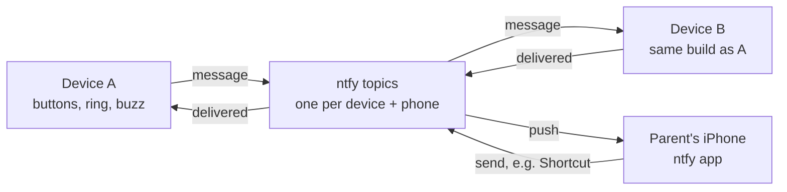

# Pebble Pager

A pair of palm-size pagers for kids on the Seeed XIAO ESP32-C3. This file is the full project spec and build guide. Look and ring states: open [docs/concept.html](docs/concept.html) in a browser. Notes for AI tools: [AGENTS.md](AGENTS.md).

## Overview

Two matching palm-size devices, each built on a Seeed XIAO ESP32-C3, swap pulse messages over Wi-Fi through ntfy, a push notification service. A pulse message is a pattern of long and short button presses that plays back on the other device as light and buzz. The same service sends every message to a parent's iPhone and lets the phone send messages back. Parts run about $40 per device, or roughly $87 for the pair with breadboards and wire.

How one message travels:

1. Holding button 1 wakes the device and records a pattern of presses. It joins a saved Wi-Fi network and posts the pattern to the other device's ntfy topic and to the phone's topic.
2. The other device, listening on its topic, plays the pattern back as light and buzz, then posts "delivered" back.
3. The phone shows the message as a notification in the ntfy app.




Device A sending to B is shown; B's messages take the same paths in reverse. The phone can post to either device's topic, for example from an iPhone Shortcut.

Two trade-offs come with this design. It's Wi-Fi only, so it works on saved networks or a phone hotspot. And ntfy holds messages for a limited time: its docs say [a couple of hours](https://docs.ntfy.sh/subscribe/api/) in one place and [12 hours by default](https://docs.ntfy.sh/faq/) in another. Plan on a couple of hours. A device off Wi-Fi longer than that can miss a message, though the phone still gets every one.

## Spec at a glance

Every required item is covered. Delivery within 30 seconds and a week of battery are estimates until the prototype is measured.

| Requirement | How it's met |
|---|---|
| Wi-Fi with saved networks, set up from a phone | Stores several networks and joins whichever is in range. Hold button 2 for 5 s to open a setup page on the phone. 2.4 GHz only. |
| Message between devices within 30 s | Each device listens on its own ntfy topic. Needs testing. |
| Always notifies a phone | Every message also posts to the phone's ntfy topic. |
| Week-long rechargeable battery | 2,000 mAh LiPo charged over USB-C, estimated at 8+ days. Needs testing. |
| Two buttons, simple to use | Large button 1 views and sends. Small recessed button 2 shows battery, opens setup and turns the device off. Sending takes a hold, so a stray tap can't send. |
| Status light | A 12-pixel light ring with a white channel plays messages and shows sending, Wi-Fi, battery and setup status. Each device has its own color, and messages play in the sender's color. |
| Palm size, popular hobbyist parts | About 75 × 46 × 17 mm, estimated. The 60 × 36 × 7 mm battery sets the size, with the XIAO stacked above it. Built from Seeed XIAO and Adafruit parts. |
| Only these devices and the phone can send | Private ntfy topics with access tokens on ntfy's paid plan. |

Also planned: remote firmware updates, offline queueing of messages, a vibration motor, and three sleep modes to stretch the battery.

Out of scope: emergency alerts, location tracking, cellular, networks with login pages, and calling 911. It supplements a phone; it does not replace one.

## Behavior

Button 1 is large and does the everyday things: view and send. Button 2 is small and recessed, for the occasional ones. A single short tap never sends anything.

| Button | Press | What happens |
|---|---|---|
| 1, large | Tap | Wakes the device and plays the waiting message. Tap again to replay the last one. |
| 1, large | Hold | Starts a recording. Each further press within 2 s adds a pulse, and it sends 2 s after the last one. |
| 2, small | Tap | Shows the battery level on the ring. |
| 2, small | Hold 5 s | The ring fills purple. Release to open Wi-Fi setup. |
| 2, small | Keep holding to 10 s | The ring turns red and empties. Release to turn the device off. Any button turns it back on. |

A recording starts with a hold of half a second or longer. After that, short and long presses both count, up to 12 presses or 15 seconds. These limits and the 2-second pause are starting values to tune.

| Ring and buzz | Meaning |
|---|---|
| Pulses in the sender's color, with matching buzzes | A message playing, on arrival or on a tap |
| One pixel blinking slowly in the sender's color | A message is waiting to be viewed |
| The device's own color while button 1 is held | Recording |
| Cyan chase | Joining Wi-Fi and sending |
| Green sweep, then a second sweep with a short buzz | Sent, then delivered |
| 3 red blinks and a long buzz | Couldn't send; queued to retry |
| 1 to 12 pixels lit | Battery level, after a button 2 tap |
| Amber blink every 60 s | Battery under 20% |
| Purple, filling then solid | Holding for setup, then setup mode |
| Red, emptying | Turning off |

## Parts list

A breadboard prototype of both devices, batteries included, costs about $87 in parts. The final-build extras add about $10. Prices marked "est." are estimates; the rest were checked on the seller's page.

| Part | Qty for the pair | Price | Used in |
|---|---|---|---|
| [Seeed XIAO ESP32-C3](https://www.seeedstudio.com/Seeed-XIAO-ESP32C3-p-5431.html), pre-soldered pins | 2 | $4.99 each (bare board) | Every step |
| Half-size breadboard | 2 | about $5 each, est. | Prototype |
| Male-to-male jumper wire kit | 1 | about $5, est. | Prototype |
| [6 mm tactile buttons, 20-pack](https://www.adafruit.com/product/367) | 1 | $2.50 | Step 3 |
| [NeoPixel Ring, 12 RGBW pixels, natural white (about 4500 K)](https://www.adafruit.com/product/2852) | 2 | $9.50 each | Step 4 |
| 1000 µF capacitor, 6.3 V or higher | 2 | about $1 each, est. | Step 4 |
| PN2222A transistor | 4 | about $2 total, est. | Steps 4 and 5 |
| [Vibrating mini motor disc](https://www.adafruit.com/product/1201) | 2 | $1.95 each | Step 5 |
| 1N4148 diode | 2 | under $1, est. | Step 5 |
| Resistor assortment with 330 Ω, 1 kΩ, 10 kΩ and 220 kΩ | 1 | about $6, est. | Steps 4, 5 and 8 |
| [LiPo 3.7 V 2,000 mAh](https://www.adafruit.com/product/2011) | 2 | $12.50 each | Step 8 |
| JST-PH 2-pin socket cable | 2 | about $1 each, est. | Step 8 |
| Enclosure, 3D printed | 2 | $3–5 each, est. | Final build |
| Thin silicone wire and perfboard | 1 set | about $2, est. | Final build |

Adafruit showed one 2,000 mAh battery in stock when checked; DigiKey also carries it, or the 2,500 mAh flat cell ($14.95) works with a slightly bigger case. The ring is 36.8 mm across and 3.25 mm thick, with a 23.3 mm center hole for the send button, so the same part serves the prototype and the final build. There is no power switch: the device turns off from button 2, and the case should leave a pinhole over the XIAO's RESET button.

## Wiring and pin plan

Both buttons sit on pins that can wake the chip from deep sleep (GPIO0–5). Nothing uses the boot-mode pins (D0, D8, D9) or the serial pins (D6, D7). The D-to-GPIO mapping was checked against a [pinout r](https://mischianti.org/seeed-studio-xiao-esp32-c3-high-resolution-pinout-datasheet-schema-and-specs/)[ef](https://mischianti.org/seeed-studio-xiao-esp32-c3-high-resolution-pinout-datasheet-schema-and-specs/)[e](https://mischianti.org/seeed-studio-xiao-esp32-c3-high-resolution-pinout-datasheet-schema-and-specs/)[re](https://mischianti.org/seeed-studio-xiao-esp32-c3-high-resolution-pinout-datasheet-schema-and-specs/)[nce](https://mischianti.org/seeed-studio-xiao-esp32-c3-high-resolution-pinout-datasheet-schema-and-specs/), and each pin's abilities against [Espressif's GPIO table](https://docs.espressif.com/projects/esp-idf/en/v5.3/esp32c3/api-reference/peripherals/gpio.html).

| Connects to | XIAO pin | GPIO | How |
|---|---|---|---|
| Battery sensor | D1 (A1) | 3 | Midpoint of two 220 kΩ resistors from battery + to GND |
| Button 1, large: view and send | D2 | 4 | Button to GND, internal pull-up |
| Button 2, small: battery, setup, off | D3 | 5 | Button to GND, internal pull-up |
| Vibration motor | D4 | 6 | 1 kΩ to a PN2222A base, 10 kΩ from base to GND |
| Ring power switch | D5 | 7 | 1 kΩ to a second PN2222A base, 10 kΩ from base to GND |
| Ring data | D10 | 10 | Through 330 Ω to DIN |
| Ring +, motor + | 3V3 | — | The + power rail |
| Battery | BAT+ / BAT− pads underneath | — | Through the JST socket |
| Left empty | D0, D6, D7, D8, D9 | 2, 21, 20, 8, 9 | Boot-mode and serial pins |

- Seeed says the board [can't report its own battery level](https://wiki.seeedstudio.com/XIAO_ESP32C3_Getting_Started/), which is why the resistor divider is there. Seeed's [battery guide](https://wiki.seeedstudio.com/check_battery_voltage/) uses the same half-voltage divider with 200 kΩ resistors. It draws about 10 µA.
- D0 is left empty because it is a boot-mode pin (GPIO2) that [Espressif's datasheet](https://documentation.espressif.com/esp32-c3_datasheet_en.pdf) recommends keeping high at startup. A button holding it low during a reset could stop the board from starting.
- D3 (GPIO5) can't take reliable analog readings, [per Seeed](https://wiki.seeedstudio.com/XIAO_ESP32C3_Pin_Multiplexing/), but works normally as a button input.
- Each transistor has a 10 kΩ resistor from its base to ground, so the motor and ring stay off while the chip is asleep or starting up.
- The ring uses SK6812 RGBW pixels, which [Adafruit lists](https://www.adafruit.com/product/2852) as a 5 V part. Here it runs from 3V3, which matches the XIAO's 3.3 V data signal. [Adafruit notes](https://learn.adafruit.com/adafruit-neopixel-uberguide/powering-neopixels) that lower voltages work, with dimmer or shifted colors. If the colors look wrong, power the ring from battery + instead, which [Adafruit's guide](https://learn.adafruit.com/adafruit-neopixel-uberguide/best-practices) accepts with a 3.3 V data signal.
- Each pixel has four LEDs at about 18 mA each, so the full ring could draw over 800 mA at full white. Seeed rates the 3V3 pin for [700 mA](https://wiki.seeedstudio.com/XIAO_ESP32C3_Getting_Started/), with Wi-Fi peaking at 335 mA and the motor at 60 mA. The firmware therefore keeps the ring dim, about 30 out of 255.
- The code must set the pixel type to four-channel (`NEO_GRBW`). With the three-color setting, colors come out scrambled and shifted around the ring.

## Power budget

A week on 2,000 mAh means averaging under about 9.5 mA, counting 80% of the battery as usable (1,600 mAh over 168 hours). Plan B, waking to check, gets built first because it works with the standard Arduino tools. Plan A, staying connected, lasts far longer but needs a different firmware toolchain.

| Plan | How it receives | Average draw, est. | Battery life, est. | Receive delay |
|---|---|---|---|---|
| A: stay connected | Wi-Fi stays joined in light sleep and the server pushes messages | About 1.5 mA | About 44 days | A few seconds |
| B: wake and check | Deep sleep, wake every 30 s, connect, check, sleep | 3–9 mA | 7–21 days | Up to 30 s |
| Away: no saved network in range | Deep sleep, wake every 5 min for a quick scan, no connection attempt | Under 1 mA | Months | Nothing arrives until it's back on Wi-Fi |
| Off: button 2 held 10 s | Deep sleep with no timer; only a button press wakes it | About 0.05 mA | Years | Nothing arrives until it's turned on |

**Sleep strategy.** On a saved network the device uses plan B to begin with. Plan A replaces it if the firmware moves to a toolchain that supports sleeping while connected. With no saved network in range it switches to away mode. A button press wakes it at once in every mode; in away mode a recorded message is queued if there's still no network. Back in range, it rejoins within 5 minutes and collects any messages ntfy still holds. Off is the same deep sleep without the timer. The 5-minute interval is a starting value to tune, and the away figures assume a 2 s scan at about 80 mA.

- These figures are modelled, not measured. They combine Espressif's documented currents with [Qoitech's bench measurements](https://www.qoitech.com/blog/esp32-s3-c3-c6-sleep-power-consumption/) of the XIAO boards. No published trace covers this exact workload, so the prototype battery test is still the real answer.
- Plan A rests on Espressif's figure of [1.4 mA while connected](https://docs.espressif.com/projects/esp-idf/en/stable/esp32c3/api-guides/low-power-mode/low-power-mode-wifi.html) for the C3 in automatic light sleep, on a router that signals every beacon. That feature [isn't included](https://github.com/espressif/arduino-esp32/issues/6563) in the standard Arduino libraries. Without it, staying connected draws about 21.5 mA and lasts about 3 days.
- Reaching plan A means rebuilding the Arduino libraries through PlatformIO, or moving to Espressif's own toolchain. Decide that after measuring plan B.
- Plan B's range depends on how long each check keeps the radio on, at about 90 mA: 3 s gives about 9 mA and 7 days, and 1 s gives about 3 mA and 21 days. Remembering the router's channel and address between wakes is the main way to shorten it.
- Sending, buzzing and lighting add little: the motor draws [60 mA at 3 V](https://www.adafruit.com/product/1201) and the ring is capped near the same, each for a second or two.
- Deep sleep measured 41.6 µA on a XIAO ESP32-C3 in Qoitech's test, close to the [43 µA Seeed lists](https://wiki.seeedstudio.com/XIAO_ESP32C3_Getting_Started/). The battery sensor adds about 10 µA.
- Measure current on battery with USB unplugged. A connected USB port keeps the chip from sleeping and inflates every reading.
- Charge time: a [pinout reference](https://mischianti.org/seeed-studio-xiao-esp32-c3-high-resolution-pinout-datasheet-schema-and-specs/) lists the XIAO's charger at about 370 mA, which would fill 2,000 mAh in roughly 6 hours. Seeed's own pages didn't state the rate when checked. That is inside the 500 mA [Adafruit recommends](https://www.adafruit.com/product/2011) for this cell.

NeoPixels draw current even when dark, commonly measured at up to about 1 mA per pixel; no datasheet figure was found for it. Twelve of them could use the whole battery budget, so a transistor on D5 cuts the ring's power whenever it isn't showing something.

To verify, have each device report its battery voltage to the server every hour, run it from full, and count the days.

## Phone and ntfy

ntfy carries everything: device to device, device to phone, and phone back to a device. There is no server of your own to run.

Use three private topics that share one long random name, for example `pebble-7qk2x9m`:

| Topic | Who listens | Who posts |
|---|---|---|
| pebble-7qk2x9m-a | Device A | Device B and the phone |
| pebble-7qk2x9m-b | Device B | Device A and the phone |
| pebble-7qk2x9m-phone | The ntfy app on the iPhone | Both devices |

- **How devices listen.** While on Wi-Fi, each device keeps a [JSON stream](https://docs.ntfy.sh/subscribe/api/) open to its topic (plan A), or checks every 30 s with `poll=1` (plan B). ntfy's free service allows [one request every 10 s](https://docs.ntfy.sh/faq/) after an initial burst of 60, so a 30 s check fits.
- **What a message contains.** The pattern travels as a short list of press and gap lengths, together with the sender's color. The copy sent to the phone is written out in words, such as "long, short, short".
- **Delivery confirmation.** ntfy has no built-in receipts, so the firmware adds them: the receiver posts "delivered" to the sender's topic when the message arrives, and "seen" to the phone's topic when it's viewed.
- **Phone notifications.** Messages use ntfy's default priority. ntfy [documents priority behavior for Android](https://docs.ntfy.sh/publish/), not iPhone, so allow ntfy through Focus modes if every message should show.
- **Phone to device.** An iPhone Shortcut using "Get Contents of URL" can POST a saved pattern to a device's topic, from the home screen or Siri. ntfy's notification action buttons are documented for Android and web only.
- **Security.** On the free tier, [the topic name works as the password](https://docs.ntfy.sh/faq/). ntfy's [Supporter plan](https://ntfy.sh/#pricing), $6 a month or $5 billed yearly, includes three reserved topics, which is exactly what this design uses. Give each device and the phone its own access token.
- **Offline queueing.** Messages recorded off Wi-Fi are saved on the device and sent at the next connection. Messages for an offline device wait on ntfy for a limited time, as the Overview notes.
- **Wi-Fi setup.** Hold button 2 for 5 s and the device opens a password-protected "Pebble-Setup" network. Join it from the iPhone's Wi-Fi settings, and a setup page opens to pick a network and enter its password. Each new network is added to a saved list, and the device joins whichever saved network is in range. Setup mode ends by itself after a few minutes.
- **Remote updates.** Once a day, or when the phone posts an update command, the device checks a firmware file you host, such as a GitHub release, and installs a newer version over Wi-Fi. Saved networks and topics are stored separately and survive updates. If the new version fails to start, the device falls back to the old one.
- **Device color.** Each device's color is a setting chosen on the setup page and stored with its saved networks, so both devices run the same firmware and the color survives updates. Because every message carries its sender's color, the receiver needs no setup to show it. Any color is allowed, including one that matches a status color or the other device.

## Risks

Battery life is the biggest unknown, so measure it on the prototype before designing the case.

| Risk | Why it matters | Fallback |
|---|---|---|
| Battery under a week | Plan B has little margin if Wi-Fi joins are slow | Shorten each check, move to plan A's toolchain, or fit the 2,500 mAh cell |
| ntfy is down or slow | Every message depends on one free service | Paid ntfy plan, or self-host ntfy later on an always-on computer |
| Messages missed while offline | ntfy keeps messages only for a limited time | The phone still gets every message; the ring shows when a send is queued |
| Accidental presses in a bag | A held button 1 sends a stray message; a held button 2 can turn the device off | A stray message is harmless. Recess button 2; any press turns the device back on |
| Ring colors look wrong | The ring runs on 3.3 V, below its rated voltage | Power it from battery + instead, as the wiring notes describe |
| School Wi-Fi blocks the device | Login pages, 5 GHz-only coverage or site filtering | Run Test sketch 3 on site; ask the school, or use a phone hotspot |
| LiPo in a kid's bag | Crushing or puncturing a LiPo is dangerous | Protected cell, padded case, no unattended charging, as [Adafruit advises](https://www.adafruit.com/product/2011) |

This device supplements a phone. It isn't for emergencies, and it doesn't share location or call 911.

## Build instructions: breadboard prototype

These steps build both devices on breadboards so you can test the buttons, ring, motor and ntfy before any case work. Steps 1 to 7 run on USB power, and step 8 adds the battery. Pager firmware isn't written yet, so steps that run code use short test sketches, marked [Test sketch]. Plan on two or three evenings.

### Tools

| Tool | Used for |
|---|---|
| Computer with Arduino IDE 2 | Programming the XIAO |
| USB-C cable that carries data | Uploading code; charge-only cables won't work |
| Wire strippers and flush cutters | Trimming component legs and wires |
| Needle-nose pliers or tweezers | Bending legs and seating small parts |
| Multimeter | Checking connections and battery polarity |
| iPhone with the ntfy app | Step 7 |
| Soldering iron with a fine tip, thin solder and flux | Steps 4 and 8 |
| Helping hands | Steps 4 and 8 |

### How a breadboard connects

> *Diagram not carried over: breadboard primer · how the holes connect. The text and the pin table in this file cover the same content.*

The diagrams below draw the board this way: the + rail is 3V3 power and the − rail is ground. Unplug USB before moving any wire, and check each connection against the step before plugging back in.

### Step 1: Set up the computer

The goal is a computer that can upload code to the XIAO and read what it prints. Do this on the bare board, before it goes in the breadboard.

> *Diagram not carried over: step 1 · computer to XIAO. The text and the pin table in this file cover the same content.*

1. Install Arduino IDE 2 from arduino.cc.
2. In File → Preferences, add this board manager URL: `https://raw.githubusercontent.com/espressif/arduino-esp32/gh-pages/package_esp32_index.json`
3. In Tools → Board → Boards Manager, search "esp32" and install "esp32 by Espressif Systems".
4. Plug the XIAO in with the data cable. Choose Tools → Board → esp32 → XIAO_ESP32C3, then the new port under Tools → Port.
5. Upload [Test sketch 1] below, then open Tools → Serial Monitor at 115200 baud.

```cpp
// Test sketch 1: prove upload and serial work
void setup() {
  Serial.begin(115200);
}

void loop() {
  Serial.println("Hello from Pebble");
  delay(1000);
}
```

**Check:** "Hello from Pebble" appears once a second.

- **Upload fails:** hold the XIAO's BOOT button while plugging it in, let go, and upload again, as [Seeed's guide](https://wiki.seeedstudio.com/XIAO_ESP32C3_Getting_Started/) describes.
- **Serial Monitor stays blank:** set Tools → USB CDC On Boot → Enabled and upload again.

### Step 2: Seat the XIAO and wire the power rails

These two short wires give every later part 3V3 power and ground. Unplug USB first.

> *Diagram not carried over: step 2 · XIAO and power rails. The text and the pin table in this file cover the same content.*

1. Press the XIAO into the breadboard across the center gap, USB end toward the left. Press evenly on both edges until the pins are fully seated.
2. Run a short wire from a free hole in the GND pin's column to the − rail.
3. Run a short wire from a free hole in the 3V3 pin's column to the + rail.

**Check:** plug USB back in. A multimeter on DC volts reads about 3.3 V between the + and − rails.

Everything in this build runs on 3V3. Nothing connects to the 5V pin.

### Step 3: Add the two buttons

Each button connects its pin to ground when pressed. The firmware turns on the pin's internal pull-up, so no resistors are needed. Button 1 becomes the large send button and button 2 the small recessed one; on the breadboard they are the same part.

> *Diagram not carried over: step 3 · the two buttons. The text and the pin table in this file cover the same content.*

1. Press button 1 across the center gap a few columns right of the XIAO.
2. Press button 2 across the gap a few columns further right.
3. Wire button 1: from D2's column to one leg's column, then from the diagonally opposite leg's column to the − rail.
4. Wire button 2 the same way, starting from D3.

The buttons get tested in step 6. D0 stays empty on purpose: it is one of the pins the chip checks at startup, and a button holding it low there could stop the board from starting.

### Step 4: Add the light ring

The ring is the pager's display: it plays messages and shows sending, Wi-Fi and battery status. It has 12 pixels, each with red, green, blue and a natural-white LED. A transistor on the ring's ground wire lets the firmware cut its power completely, because NeoPixels draw current even when dark. This is the first step that needs soldering.

> *Diagram not carried over: step 4 · light ring wiring map. The text and the pin table in this file cover the same content.*

1. In Arduino IDE, open Tools → Manage Libraries, search "Adafruit NeoPixel" and install it.
2. Find three pads on the back of the ring: power (marked 5V or PWR), ground (GND) and data input (IN). Solder a wire about 10 cm long to each. Leave the data output pad empty.
3. Unplug USB. Wire the ring's power pad to the + rail. It runs on 3V3 in this build, not 5 V.
4. Data: a 330 Ω resistor from D10's column to a free column, then a jumper from there to the ring's data input wire.
5. Seat a PN2222A with each leg in its own column. With the flat face toward you and legs down, the legs are usually E, B, C from left to right. Some versions, like the P2N2222A, swap the outer two, so check your part's datasheet.
6. Collector: the ring's GND wire. Emitter: a jumper to the − rail.
7. Base: a 1 kΩ resistor from the middle leg's column to a free column, then a jumper from there to D5. Add a 10 kΩ resistor from the base's column to the − rail.
8. Put the 1000 µF capacitor across the + and − rails, with its striped leg (−) in the − rail.

The 10 kΩ resistor keeps the ring switched off while the chip is asleep or starting up. The ring gets tested in step 6.

### Step 5: Add the vibration motor

A pin can't drive the motor directly, so a second transistor switches it. When D4 goes high, current flows from the + rail through the motor and the transistor to ground. The diode catches the voltage spike the motor makes when it stops.

> *Diagram not carried over: step 5 · vibration motor wiring map. The text and the pin table in this file cover the same content.*

1. Seat a second PN2222A to the right of the first, with each leg in its own column. The leg order is the same as in step 4.
2. Base: a 1 kΩ resistor from the middle leg's column to a free column, then a jumper from there to D4. Add a 10 kΩ resistor from the base's column to the − rail.
3. Emitter: a wire from the emitter's column to the − rail.
4. Motor: the red lead to the + rail and the blue lead into the collector's column. The leads are thin, so twist each one tight before pushing it in, or tape the motor to the board's edge.
5. Diode: from the collector's column to the + rail, with the striped end on the + rail.

**Check:** nothing buzzes yet. The motor runs only when D4 goes high, which the step 6 test does.

### Step 6: Test the buttons, ring and motor

This sketch checks every part wired so far. It isn't the pager firmware; it just lights and buzzes on each press so you can see each connection works.

> *Diagram not carried over: step 6 · what each press should do. The text and the pin table in this file cover the same content.*

1. Plug USB back in and upload [Test sketch 2] below.
2. Open the Serial Monitor at 115200 baud.
3. Watch for the blue sweep and the white flash, then try each button and compare with the picture.

```cpp
// Test sketch 2: buttons, light ring and motor
#include <Adafruit_NeoPixel.h>

const int BTN1 = D2, BTN2 = D3, MOTOR = D4, RING_PWR = D5, RING_DATA = D10;
const int PIXELS = 12;
// NEO_GRBW: four-channel pixels (red, green, blue, white)
Adafruit_NeoPixel ring(PIXELS, RING_DATA, NEO_GRBW + NEO_KHZ800);

// Light the first `count` pixels in one color
void light(int count, uint32_t color) {
  ring.clear();
  for (int i = 0; i < count; i++) ring.setPixelColor(i, color);
  ring.show();
}

void setup() {
  Serial.begin(115200);
  pinMode(BTN1, INPUT_PULLUP);
  pinMode(BTN2, INPUT_PULLUP);
  pinMode(MOTOR, OUTPUT);
  pinMode(RING_PWR, OUTPUT);
  digitalWrite(RING_PWR, HIGH);         // switch the ring's power on
  delay(10);
  ring.begin();
  ring.setBrightness(30);               // out of 255: soft, and easy on the 3V3 supply
  for (int i = 1; i <= PIXELS; i++) {   // blue sweep: every pixel works
    light(i, ring.Color(0, 0, 255, 0));
    delay(100);
  }
  light(PIXELS, ring.Color(0, 0, 0, 255));   // white LEDs only
  delay(700);
  light(0, 0);
}

void loop() {
  if (digitalRead(BTN1) == LOW) {
    Serial.println("Button 1");
    light(PIXELS, ring.Color(255, 40, 90, 60));   // soft pink: color plus a little white
    digitalWrite(MOTOR, HIGH);
    while (digitalRead(BTN1) == LOW) delay(10);
    digitalWrite(MOTOR, LOW);
    light(0, 0);
  }
  if (digitalRead(BTN2) == LOW) {
    Serial.println("Button 2");
    light(9, ring.Color(0, 255, 0, 0));           // like a battery gauge: 9 of 12
    digitalWrite(MOTOR, HIGH);
    delay(100);
    digitalWrite(MOTOR, LOW);
    delay(900);
    light(0, 0);
  }
}
```

**Check:** all three rows match the picture.

If something's off:

- **The ring stays dark:** check that the ring's power wire reaches the + rail, that the data wire is on the input pad and not the output pad, and that the 1 kΩ from D5 goes to the transistor's middle leg. If you're unsure of the transistor's pinout, swap its outer two legs.
- **Colors are scrambled or shift around the ring:** the sketch's pixel type is wrong. It must be `NEO_GRBW` for this ring.
- **Colors flicker or look dim:** recheck the data wire and its 330 Ω resistor. If they're fine, the ring may not like 3.3 V; the wiring notes above give the fallback.
- **A button does nothing:** check that both of its wires reach the button's columns and that the button is pressed fully into the board.
- **A button fires over and over without a press:** the button is turned 90°, so the two wired legs are always connected. Turn it a quarter turn, or wire the diagonally opposite leg as in step 3.
- **The ring works but nothing buzzes:** check that the 1 kΩ from D4 goes to the motor transistor's middle leg and that the emitter, not the collector, goes to the − rail.

### Step 7: Set up ntfy and send a test message

ntfy needs no account to start. On the free tier the topic name works as the password, so pick a long random one and don't post it anywhere.

> *Diagram not carried over: step 7 · two test messages to the phone. The text and the pin table in this file cover the same content.*

1. Snap the small antenna that came with the XIAO onto its connector, pressing straight down until it clicks. Without it, Wi-Fi barely reaches across a room.
2. Pick a base name: `pebble-` plus at least seven random letters and digits, like `pebble-7qk2x9m`. Your three topics are that name plus `-a`, `-b` and `-phone`.
3. On the iPhone, install ntfy from the App Store and allow notifications when it asks. Tap +, enter your `-phone` topic, and keep the default server, ntfy.sh.
4. Test 1, from the computer: in a terminal, run `curl -d "Hello from the computer" ntfy.sh/pebble-7qk2x9m-phone` with your own topic. Or open ntfy.sh/app in a browser, subscribe to the same topic and publish from there. The phone should show it within a few seconds.
5. Test 2, from the breadboard: in [Test sketch 3] below, fill in your Wi-Fi name, password and topic. The network must be 2.4 GHz.
6. Upload it and open the Serial Monitor at 115200 baud. It sends once each time the board starts; press RESET to send again.

```cpp
// Test sketch 3: send one message to the phone through ntfy
#include <WiFi.h>
#include <WiFiClientSecure.h>
#include <HTTPClient.h>

const char* WIFI_NAME = "[YOUR WIFI]";
const char* WIFI_PASS = "[YOUR PASSWORD]";
const char* TOPIC_URL = "https://ntfy.sh/[your-base]-phone";

void setup() {
  Serial.begin(115200);
  delay(1000);
  WiFi.begin(WIFI_NAME, WIFI_PASS);
  Serial.print("Joining Wi-Fi");
  while (WiFi.status() != WL_CONNECTED) {
    delay(500);
    Serial.print(".");
  }
  Serial.println(" Wi-Fi connected");

  WiFiClientSecure client;
  client.setInsecure(); // test only: skips the certificate check
  HTTPClient http;
  http.begin(client, TOPIC_URL);
  http.addHeader("Title", "Pebble test");
  http.addHeader("Priority", "high");
  int code = http.POST("Hello from the breadboard");
  Serial.printf("ntfy replied %d\n", code);
  http.end();
}

void loop() {}
```

**Check:** the Serial Monitor shows "Wi-Fi connected" and "ntfy replied 200", and the phone shows a notification titled "Pebble test" that reads "Hello from the breadboard".

- **Dots forever:** wrong password, or the network is 5 GHz only. An iPhone hotspot works as a test network with Maximize Compatibility turned on.
- **A negative reply code:** Wi-Fi joined but the request failed. Check that the topic URL starts with `https://ntfy.sh/`.
- **Reply 429:** too many messages too fast. Wait a minute, then press RESET.

`client.setInsecure()` skips checking ntfy's certificate to keep the test short. The pager firmware will check it.

### Step 8 (optional): Add the battery and battery sensor

With a battery on its BAT pads, the XIAO runs without USB and charges the battery whenever USB is plugged in. The resistor pair lets D1 measure the battery, since the board can't report its own level. This step means soldering tiny pads next to a LiPo, so go slowly.

> *Diagram not carried over: step 8 · battery and battery sensor. The text and the pin table in this file cover the same content.*

1. Check polarity before soldering anything. Plug the battery into the JST socket cable and set the multimeter to DC volts, red probe on the cable's red wire and black probe on its black wire. About 3.7 to 4.2 V means the colors are right. A minus sign means they're swapped, so treat the black wire as + from here on. Unplug the battery.
2. Take the XIAO out of the breadboard and tin the BAT+ and BAT− pads underneath with a little solder.
3. Solder the cable's + wire to BAT+ and its − wire to BAT−. On the BAT+ pad, also solder one end of a short jumper wire; it carries battery + up to the breadboard for the sensor.
4. Reseat the XIAO with the wires led out the side, and plug the jumper's free end into an empty column. That column is now battery +.
5. Divider: a 220 kΩ resistor from the battery + column to a free column, a second 220 kΩ from that column to the − rail, and a jumper from the middle column to D1.
6. Plug the battery in, connect USB, and upload [Test sketch 4].

```cpp
// Test sketch 4: read the battery voltage
#include <Adafruit_NeoPixel.h>

const int BATT = D1, RING_PWR = D5, RING_DATA = D10;
Adafruit_NeoPixel ring(12, RING_DATA, NEO_GRBW + NEO_KHZ800);

void setup() {
  Serial.begin(115200);
  pinMode(RING_PWR, OUTPUT);
  digitalWrite(RING_PWR, HIGH);    // switch the ring's power on
  delay(10);
  ring.begin();
  ring.setBrightness(30);
}

void loop() {
  // Average 16 readings, as Seeed's battery guide does, to smooth out noise.
  // The two equal resistors halve the voltage, so double the result.
  uint32_t mv = 0;
  for (int i = 0; i < 16; i++) mv += analogReadMilliVolts(BATT);
  float volts = 2 * mv / 16 / 1000.0;
  Serial.printf("Battery: %.2f V\n", volts);

  ring.setPixelColor(0, ring.Color(0, 255, 0, 0));   // green blink: still running
  ring.show();
  delay(100);
  ring.clear();
  ring.show();
  delay(1900);
}
```

**Check:** with USB in, the Serial Monitor shows about 3.7–4.2 V, creeping up as the battery charges. Unplug USB and the first pixel keeps blinking green, which means the board is running on the battery. If the reading is more than about 0.2 V off from the multimeter across the battery, note the difference; the firmware can correct for it.

From now on, unplug the battery as well as USB before moving any wire, since the battery powers the rails too. Don't leave it charging unattended, and if the cell swells, gets hot or smells odd, unplug it and move it somewhere it can't catch anything on fire.

### Step 9: Build device B and plan the end-to-end test

Repeat steps 2 to 8 on the second XIAO and breadboard, then run Test sketches 2 and 3 on it. Put a strip of tape on each board marked A or B so the topics don't get mixed up.

That's as far as the breadboards go without pager firmware. Once it's written, flash both boards and work through this list. Each line comes from the Spec and Behavior sections, and the diagram in the Overview shows the paths they cover.

- Both devices show a cyan chase at startup, then join the saved Wi-Fi.
- Hold button 1 on A, then press a long-short-short pattern: A's ring lights in A's color with each press and sends 2 s after the last one.
- B plays the same pattern as pulses in A's color with matching buzzes within 30 s, and the phone shows the message.
- A shows a green sweep when it sends, then a second sweep with a short buzz when B confirms delivery.
- B blinks one pixel in A's color until button 1 is tapped. The tap plays the message, and a second tap replays it.
- A single short tap on button 1 never sends anything.
- Tap button 2: the ring shows the battery level.
- Hold button 2 for 5 s and release: the ring fills purple, "Pebble-Setup" appears, and a new network can be added from the phone.
- Hold button 2 for 10 s and release: the ring empties red and the device turns off. Any button turns it back on.
- Turn off A's Wi-Fi, record a message, then turn the Wi-Fi back on: the queued message goes out.
- Send from the iPhone Shortcut to each device's topic: each one plays the pattern.
- Time ten messages each way: every one arrives within 30 s.
- Take a device out of range of every saved network for an hour, then bring it back: it rejoins within 5 minutes and delivers anything queued.
- Run each device from full on battery with the hourly voltage report and count the days. The target is seven.
- As the battery drops below 20%, the ring blinks amber every 60 s.
- After a firmware update over Wi-Fi, the saved networks are still there.
- Change A's color on the setup page: A's next message plays on B in the new color, and the color is still set after a firmware update.

The last few results, delivery time and battery days, decide between plan A and plan B and settle the battery size before the case is designed.
