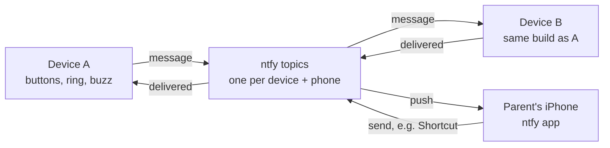

# Pebble Pager

A pair of palm-size pagers for kids on the Seeed XIAO ESP32-C3. This file is the project spec. Wiring and test steps: [docs/build-steps.md](docs/build-steps.md). Look and ring states: open [docs/concept.html](docs/concept.html) in a browser. AI tools: [AGENTS.md](AGENTS.md).

## Overview

Two matching palm-size devices, each built on a Seeed XIAO ESP32-C3, swap pulse messages over Wi-Fi through ntfy, a push notification service. A pulse message is a pattern of long and short button presses that plays back on the other device as light and buzz. The same service sends every message to a parent's iPhone and lets the phone send messages back. Parts run about $40 per device, or roughly $87 for the pair with breadboards and wire.

How one message travels:

1. Holding button 1 wakes the device and records a pattern of presses. It joins a saved Wi-Fi network and posts the pattern to the other device's ntfy topic and to the phone's topic.
2. The other device, listening on its topic, plays the pattern back as light and buzz, then posts "delivered" back.
3. The phone shows the message as a notification in the ntfy app.

Device A sending to B is shown; B's messages take the same paths in reverse. The phone can post to either device's topic, for example from an iPhone Shortcut.

Two trade-offs come with this design. It's Wi-Fi only, so it works on saved networks or a phone hotspot. And ntfy holds messages for a limited time: its docs say a couple of hours in one place and 12 hours by default in another. Plan on a couple of hours. A device off Wi-Fi longer than that can miss a message, though the phone still gets every one.

Also planned: remote firmware updates, offline queueing, a vibration motor, and three sleep modes to stretch the battery. Delivery within 30 s and a week of battery are estimates until the prototype is measured.

Out of scope: emergency alerts, location tracking, cellular, networks with login pages, and calling 911. It supplements a phone; it does not replace one.

## Behavior

Button 1 is large and does the everyday things: view and send. Button 2 is small and recessed, for the occasional ones. A single short tap never sends anything.

| Button | Press | What happens |
|---|---|---|
| 1, large | Tap | Wakes the device and plays the waiting message. Tap again to replay the last one. |
| 1, large | Hold | Starts a recording. Each further press within 2 s adds a pulse, and it sends 2 s after the last one. |
| 2, small | Tap | Shows the battery level on the ring. |
| 2, small | Hold 5 s | The ring fills purple. Release to open Wi-Fi setup. |
| 2, small | Keep holding to 10 s | The ring turns red and empties. Release to turn the device off. Any button turns it back on. |

A recording starts with a hold of half a second or longer. After that, short and long presses both count, up to 12 presses or 15 seconds. These limits and the 2-second pause are starting values to tune.

| Ring and buzz | Meaning |
|---|---|
| Pulses in the sender's color, with matching buzzes | A message playing, on arrival or on a tap |
| One pixel blinking slowly in the sender's color | A message is waiting to be viewed |
| The device's own color while button 1 is held | Recording |
| Cyan chase | Joining Wi-Fi and sending |
| Green sweep, then a second sweep with a short buzz | Sent, then delivered |
| 3 red blinks and a long buzz | Couldn't send; queued to retry |
| 1 to 12 pixels lit | Battery level, after a button 2 tap |
| Amber blink every 60 s | Battery under 20% |
| Purple, filling then solid | Holding for setup, then setup mode |
| Red, emptying | Turning off |

## Parts list

A breadboard prototype of both devices, batteries included, costs about $87 in parts. The final-build extras add about $10. Prices marked "est." are estimates; the rest were checked on the seller's page.

| Part | Qty for the pair | Price | Used in |
|---|---|---|---|
| [Seeed XIAO ESP32-C3](https://www.seeedstudio.com/Seeed-XIAO-ESP32C3-p-5431.html), pre-soldered pins | 2 | $4.99 each (bare board) | Every step |
| Half-size breadboard | 2 | about $5 each, est. | Prototype |
| Male-to-male jumper wire kit | 1 | about $5, est. | Prototype |
| [6 mm tactile buttons, 20-pack](https://www.adafruit.com/product/367) | 1 | $2.50 | Step 3 |
| [NeoPixel Ring, 12 RGBW pixels, natural white (about 4500 K)](https://www.adafruit.com/product/2852) | 2 | $9.50 each | Step 4 |
| 1000 µF capacitor, 6.3 V or higher | 2 | about $1 each, est. | Step 4 |
| PN2222A transistor | 4 | about $2 total, est. | Steps 4 and 5 |
| [Vibrating mini motor disc](https://www.adafruit.com/product/1201) | 2 | $1.95 each | Step 5 |
| 1N4148 diode | 2 | under $1, est. | Step 5 |
| Resistor assortment with 330 Ω, 1 kΩ, 10 kΩ and 220 kΩ | 1 | about $6, est. | Steps 4, 5 and 8 |
| [LiPo 3.7 V 2,000 mAh](https://www.adafruit.com/product/2011) | 2 | $12.50 each | Step 8 |
| JST-PH 2-pin socket cable | 2 | about $1 each, est. | Step 8 |
| Enclosure, 3D printed | 2 | $3–5 each, est. | Final build |
| Thin silicone wire and perfboard | 1 set | about $2, est. | Final build |

Adafruit showed one 2,000 mAh battery in stock when checked; DigiKey also carries it, or the 2,500 mAh flat cell ($14.95) works with a slightly bigger case. The ring is 36.8 mm across and 3.25 mm thick, with a 23.3 mm center hole for the send button, so the same part serves the prototype and the final build. There is no power switch: the device turns off from button 2, and the case should leave a pinhole over the XIAO's RESET button.

## Wiring and pin plan

Both buttons sit on GPIO0–5, which can wake the chip from deep sleep. Boot-mode pins (D0, D8, D9) and serial pins (D6, D7) are unused.

| Connects to | XIAO pin | GPIO | How |
|---|---|---|---|
| Battery sensor | D1 (A1) | 3 | Midpoint of two 220 kΩ resistors from battery + to GND |
| Button 1, large: view and send | D2 | 4 | Button to GND, internal pull-up |
| Button 2, small: battery, setup, off | D3 | 5 | Button to GND, internal pull-up |
| Vibration motor | D4 | 6 | 1 kΩ to a PN2222A base, 10 kΩ from base to GND |
| Ring power switch | D5 | 7 | 1 kΩ to a second PN2222A base, 10 kΩ from base to GND |
| Ring data | D10 | 10 | Through 330 Ω to DIN |
| Ring +, motor + | 3V3 | — | The + power rail |
| Battery | BAT+ / BAT− pads underneath | — | Through the JST socket |
| Left empty | D0, D6, D7, D8, D9 | 2, 21, 20, 8, 9 | Boot-mode and serial pins |

- The board can't report its own battery level, so a half-voltage divider on D1 measures it (Seeed's guide uses 200 kΩ; this uses 220 kΩ). It draws about 10 µA.
- D0 (GPIO2) is a boot-mode pin that must be high at startup; a button holding it low could stop the board from starting.
- D3 (GPIO5) can't take reliable analog readings but works as a button input.
- A 10 kΩ from each transistor base to ground keeps the motor and ring off while the chip sleeps or starts.
- The ring's SK6812 RGBW pixels are rated 5 V but run from 3V3 here, matching the XIAO's 3.3 V data signal. Colors may look dimmer or shifted; if so, power the ring from battery + instead.
- A full ring could draw over 800 mA (12 pixels × 4 LEDs × about 18 mA), but the 3V3 pin is rated 700 mA, with Wi-Fi peaking at 335 mA and the motor at 60 mA. Keep ring brightness around 30 of 255.
- The ring pixel type must be four-channel GRBW, or colors come out scrambled.

## Power budget

A week on 2,000 mAh means averaging under about 9.5 mA (80% usable: 1,600 mAh over 168 h). Plan B gets built first because it works with the standard Arduino tools. Plan A lasts far longer but needs a different toolchain.

| Plan | How it receives | Average draw, est. | Battery life, est. | Receive delay |
|---|---|---|---|---|
| A: stay connected | Wi-Fi stays joined in light sleep and the server pushes messages | About 1.5 mA | About 44 days | A few seconds |
| B: wake and check | Deep sleep, wake every 30 s, connect, check, sleep | 3–9 mA | 7–21 days | Up to 30 s |
| Away: no saved network in range | Deep sleep, wake every 5 min for a quick scan, no connection attempt | Under 1 mA | Months | Nothing arrives until back on Wi-Fi |
| Off: button 2 held 10 s | Deep sleep with no timer; only a button press wakes it | About 0.05 mA | Years | Nothing arrives until turned on |

**Sleep strategy.** On a saved network use plan B. With no saved network in range, switch to away mode. A button press wakes the device at once in every mode; in away mode a recorded message is queued if there's still no network. Back in range it rejoins within 5 minutes and collects messages ntfy still holds. The 5-minute interval is a starting value to tune; the away figure assumes a 2 s scan at about 80 mA.

- All figures are modelled (Espressif's documented currents plus Qoitech's bench measurements of XIAO boards), not measured. The prototype battery test decides.
- Plan A relies on Espressif's 1.4 mA connected light-sleep figure, which needs a router that signals every beacon and isn't in the standard Arduino libraries. Without it, staying connected draws about 21.5 mA (about 3 days). Reaching plan A means rebuilding the libraries with PlatformIO or using Espressif's own toolchain. Decide after measuring plan B.
- Plan B depends on radio-on time per check at about 90 mA: 3 s gives about 9 mA (7 days), 1 s gives about 3 mA (21 days). Remembering the router's channel and address between wakes is the main way to shorten it.
- Bench result for plan B (`TEST` 6, on USB, 160 MHz, cached channel, router address and IP): join about 1.7 s, poll 0.5–3.3 s, awake typically 2.5–3.5 s, which is about 8–10.5 mA and 6–8 days. Running at 80 MHz made each wake longer and was worse. A derived Wi-Fi key doesn't help: hashing takes only 0.4 s and Arduino rejects the hex key. About 1 join in 12 with the cached address fails and costs about 7 s. A 2,500 mAh cell gives margin.
- Sending, buzzing and lighting add little: the motor draws 60 mA and the ring is capped near the same, each for a second or two.
- Deep sleep measured 41.6 µA on a XIAO ESP32-C3 (Seeed lists 43 µA). The battery sensor adds about 10 µA.
- Measure on battery with USB unplugged; USB keeps the chip awake and inflates every reading.
- Charging: the XIAO's charger is listed at about 370 mA (Seeed doesn't state it), roughly 6 hours for 2,000 mAh, within the 500 mA Adafruit recommends for this cell.
- NeoPixels draw current even when dark (up to about 1 mA per pixel, no datasheet figure), so the D5 transistor cuts ring power whenever it isn't showing something.
- To verify, have each device report its battery voltage to ntfy every hour, run it from full, and count the days.

## Phone and ntfy

ntfy carries everything: device to device, device to phone, and phone back to a device. There is no server of your own to run.

Use three private topics that share one long random name, for example `pebble-7qk2x9m`:

| Topic | Who listens | Who posts |
|---|---|---|
| pebble-7qk2x9m-a | Device A | Device B and the phone |
| pebble-7qk2x9m-b | Device B | Device A and the phone |
| pebble-7qk2x9m-phone | The ntfy app on the iPhone | Both devices |

- **Listening.** Plan A keeps a JSON stream open to the topic. Plan B polls every 30 s. ntfy's free service allows one request every 10 s after an initial burst of 60, so 30 s fits.
- **Message contents.** A short list of press and gap lengths plus the sender's color. The copy sent to the phone is written in words, such as "long, short, short".
- **Receipts.** ntfy has none, so the firmware adds them: the receiver posts "delivered" to the sender's topic on arrival, and "seen" to the phone's topic when viewed.
- **Phone notifications.** Default priority. ntfy documents priority behavior for Android, not iPhone, so allow ntfy through Focus modes.
- **Phone to device.** An iPhone Shortcut using "Get Contents of URL" can POST a saved pattern to a device's topic. ntfy's action buttons are documented for Android and web only.
- **Security.** On the free tier the topic name is the password. The Supporter plan ($6/month, or $5 billed yearly) includes three reserved topics, exactly what this design uses. Give each device and the phone its own access token.
- **Offline queueing.** Messages recorded off Wi-Fi are saved on the device and sent at the next connection. Messages for an offline device wait on ntfy for a limited time.
- **Wi-Fi setup.** Hold button 2 for 5 s and the device opens a password-protected "Pebble-Setup" network. Join it from the iPhone, and a setup page opens to pick a network and enter its password. Each network is added to a saved list, and the device joins whichever is in range. Setup mode ends by itself after a few minutes. In the prototype the update build (`TEST` 7) includes this page: it opens by itself when no saved network can be joined, or by holding BOOT 5 s and releasing (10 s and release forgets all networks). The page is at `http://192.168.4.1`; iPhones don't always open it on their own, so go there by hand if it doesn't appear.
- **Remote updates.** Built and tested in `TEST` 7 against real GitHub releases (`releases/latest/download/`). The device joins a saved network, syncs the clock over NTP, and fetches `manifest.txt` (version, size, SHA-256) over HTTPS with real certificate checking. A newer `.bin` is installed only if its size and SHA-256 match; the new image stays on probation until it reaches the update server, then posts "Updated from vX to vY" to the phone topic. **Triggers:** the phone posts `update` to the device's own topic (`<base>-a`), which the device reads every 30 s; a daily check is the fallback (24 h, `DAILY_CHECK_MS`); a BOOT tap also checks. A command gets short replies on the phone topic: "Checking for update", then "Updated from vX to vY", "Up to date (vX)", "Failed update to vY: bad hash, still on vX" (or bad size, too big), "Skipped vY (failed before), still on vX" or "Can't reach server, still on vX". All ntfy and serial text in the prototype is kept short on purpose; the failure replies were compiled but not re-tested after the rewording. Other messages are ignored, case and spaces don't matter, several commands in one poll cause one check, and the last command id is kept across reboots so old commands never replay (an empty topic records the time, so the first command is not swallowed). **Verified through ntfy:** normal update by command and by the daily check; first command on an empty topic; no replay across reboots; unknown and malformed commands ignored; burst of three commands; a crashing image rolls back, posts "update failed", and is never retried; a wrong SHA-256 or size is rejected before anything is installed, and a repeat command says the version is skipped; a reset mid-download leaves the old image running and the retry completes; repeated reboots post nothing extra. Commands take 7–17 s to answer after the device reads them, and GitHub can serve a stale manifest for about a minute after a release changes. **Not done yet:** signature checking (the hash only catches corruption, so anyone who can replace the release files could ship firmware); skipping updates when the battery is low (no battery sensor yet); and a power cut before the first Wi-Fi join after an update would roll back a good image and skip it, which the full build should fix by validating after a clean boot instead. To publish: compile with `--output-dir`, write `manifest.txt` for the `.bin`, attach both to a release as `pebble-prototype.bin` and `manifest.txt`. The layout is `PartitionScheme=min_spiffs`: two 1.9 MB app slots (the prototype uses 1.18 MB, 59%) and a 128 KB file area that nothing uses; changing the layout needs a USB flash, not an update.
- **Device name and color.** Both are settings on the Wi-Fi setup page: a text field for the name (letters, digits, space, hyphen, underscore, dot; up to 20 characters) and a dropdown for the color (Pink, Blue, Green, Purple, Orange, Teal, Yellow, Red). They default to "Eliana" and Pink, are stored with the saved networks, survive firmware updates and the 10 s clear (which removes only the networks), and are used in every ntfy and serial message, for example "Eliana updated from v26 to v27" and "Eliana up to date (v27)". Because every message carries its sender's color, the receiver needs no setup to show it. Any color is allowed, including one that matches a status color or the other device.

## Risks

Battery life is the biggest unknown, so measure it on the prototype before designing the case.

| Risk | Why it matters | Fallback |
|---|---|---|
| Battery under a week | Plan B has little margin if Wi-Fi joins are slow | Shorten each check, move to plan A's toolchain, or fit the 2,500 mAh cell |
| ntfy is down or slow | Every message depends on one free service | Paid ntfy plan, or self-host ntfy later on an always-on computer |
| Messages missed while offline | ntfy keeps messages only for a limited time | The phone still gets every message; the ring shows when a send is queued |
| Accidental presses in a bag | A held button 1 sends a stray message; a held button 2 can turn the device off | A stray message is harmless. Recess button 2; any press turns the device back on |
| Ring colors look wrong | The ring runs on 3.3 V, below its rated voltage | Power it from battery + instead, as the wiring notes describe |
| School Wi-Fi blocks the device | Login pages, 5 GHz-only coverage or site filtering | Run Test sketch 3 on site; ask the school, or use a phone hotspot |
| LiPo in a kid's bag | Crushing or puncturing a LiPo is dangerous | Protected cell, padded case, no unattended charging, as Adafruit advises |

This device supplements a phone. It isn't for emergencies, and it doesn't share location or call 911.
