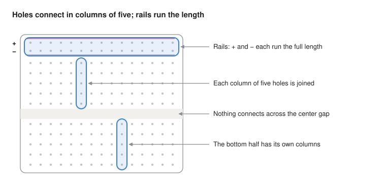
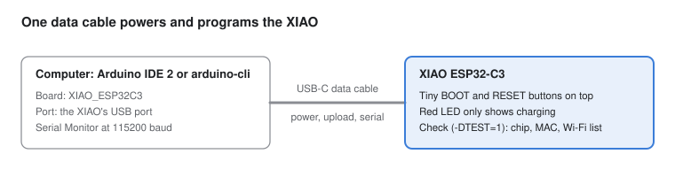
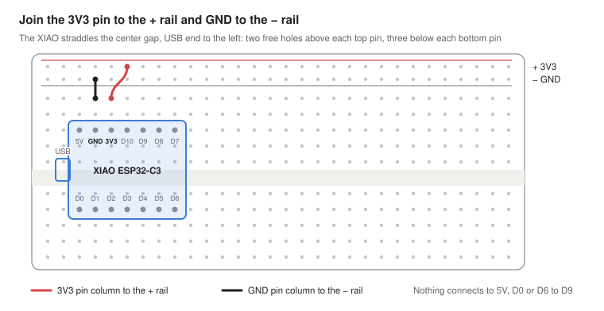
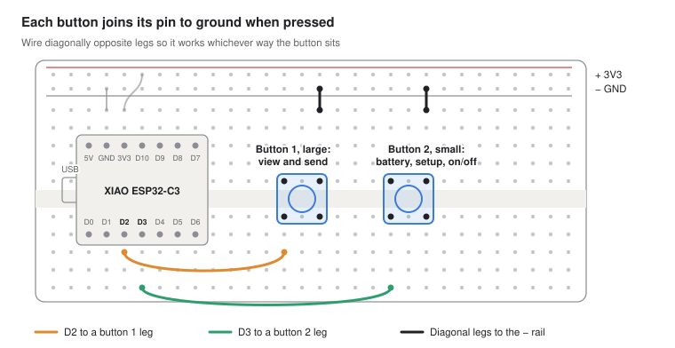
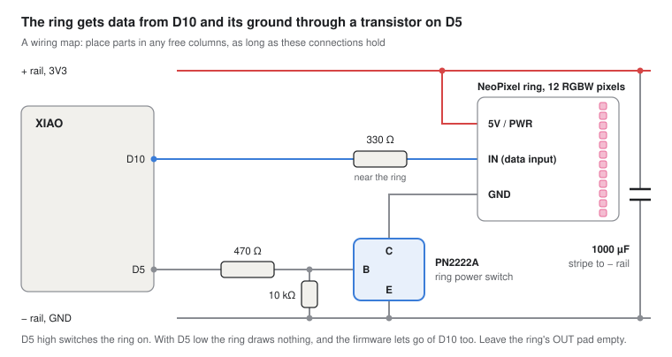
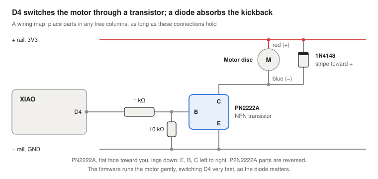
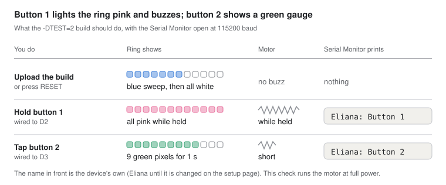
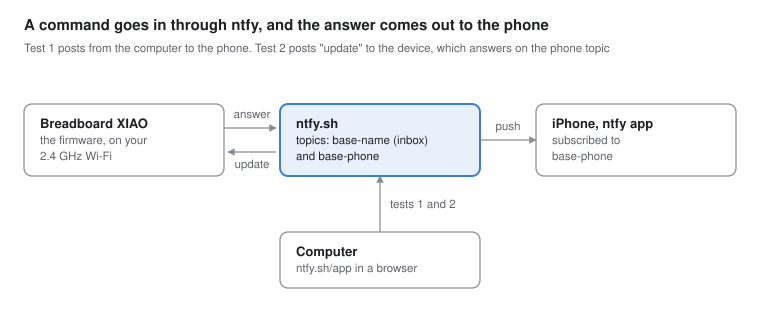
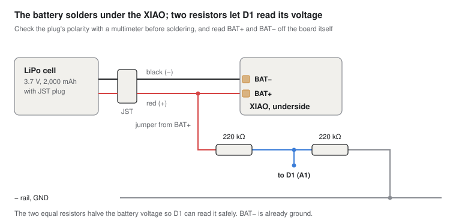

# Breadboard build steps

These steps build both devices on breadboards so you can test the buttons, ring, motor and ntfy before any case work. Steps 1 to 7 run on USB power, and step 8 adds the battery. Steps that run code use the firmware in `firmware/pebble-pager`, built either as itself or as one of its hardware checks with `-DTEST=n`. The checks come first because they are simple: they light and buzz with nothing else going on, so a wiring fault is easy to see. The firmware's own ring, motor and battery code has not run on real parts yet, so steps 7 to 9 are also its first test. Plan on two or three evenings.

## Tools

| Tool | Used for |
|---|---|
| Computer with Arduino IDE 2 | Programming the XIAO |
| USB-C cable that carries data | Uploading code; charge-only cables won't work |
| Wire strippers and flush cutters | Trimming component legs and wires |
| Needle-nose pliers or tweezers | Bending legs and seating small parts |
| Multimeter | Checking connections and battery polarity |
| iPhone with the ntfy app | Step 7 |
| Soldering iron with a fine tip, thin solder and flux | Steps 4 and 8 |
| Helping hands | Steps 4 and 8 |

## How a breadboard connects

The diagrams below draw the board this way: the + rail is 3V3 power and the − rail is ground. Unplug USB before moving any wire, and check each connection against the step before plugging back in.

## Step 1: Set up the computer

The goal is a computer that can upload code to the XIAO and read what it prints. Do this on the bare board, before it goes in the breadboard.

1. Install Arduino IDE 2 from arduino.cc.
2. In File → Preferences, add this board manager URL: `https://raw.githubusercontent.com/espressif/arduino-esp32/gh-pages/package_esp32_index.json`
3. In Tools → Board → Boards Manager, search "esp32" and install "esp32 by Espressif Systems".
4. Plug the XIAO in with the data cable. Choose Tools → Board → esp32 → XIAO_ESP32C3, then the new port under Tools → Port.
5. Upload the firmware with `-DTEST=1`, then open Tools → Serial Monitor at 115200 baud.

**Check:** the board prints its chip, MAC address and temperature, then a list of nearby Wi-Fi networks. No wiring is needed.

- **Upload fails:** hold the XIAO's BOOT button while plugging it in, let go, and upload again, as Seeed's guide describes.
- **Serial Monitor stays blank:** set Tools → USB CDC On Boot → Enabled and upload again.

## Step 2: Seat the XIAO and wire the power rails

These two short wires give every later part 3V3 power and ground. Unplug USB first.

1. Press the XIAO into the breadboard across the center gap, USB end toward the left. Its two rows of pins are 0.6 inch apart, so it cannot sit evenly: leave two free holes above each top pin and three below each bottom pin (or the other way round). Press evenly on both edges until the pins are fully seated. With the USB end to the left, the top row reads 5V, GND, 3V3, D10, D9, D8, D7 and the bottom row D0 to D6.
2. Run a short wire from a free hole in the GND pin's column to the − rail.
3. Run a short wire from a free hole in the 3V3 pin's column to the + rail.

**Check:** plug USB back in. A multimeter on DC volts reads about 3.3 V between the + and − rails.

Everything in this build runs on 3V3. Nothing connects to the 5V pin.

## Step 3: Add the two buttons

Each button connects its pin to ground when pressed. The firmware turns on the pin's internal pull-up, so no resistors are needed. Button 1 becomes the large send button and button 2 the small recessed one; on the breadboard they are the same part.

1. Press button 1 across the center gap a few columns right of the XIAO.
2. Press button 2 across the gap a few columns further right.
3. Wire button 1: from D2's column to one leg's column, then from the diagonally opposite leg's column to the − rail.
4. Wire button 2 the same way, starting from D3.

The buttons get tested in step 6. D0 stays empty on purpose: it is one of the pins the chip checks at startup, and a button holding it low there could stop the board from starting.

## Step 4: Add the light ring

The ring is the pager's display: it plays messages and shows sending, Wi-Fi and battery status. It has 12 pixels, each with red, green, blue and a natural-white LED. A transistor on the ring's ground wire lets the firmware cut its power completely, because NeoPixels draw current even when dark. This is the first step that needs soldering.

1. In Arduino IDE, open Tools → Manage Libraries, search "Adafruit NeoPixel" and install it.
2. Find three pads on the back of the ring: power (marked 5V or PWR), ground (GND) and data input (IN). Solder a wire about 10 cm long to each. Leave the data output pad empty.
3. Unplug USB. Wire the ring's power pad to the + rail. It runs on 3V3 in this build, not 5 V.
4. Data: a jumper from D10's column to a free column, a 330 Ω resistor from there to another free column, and the ring's data input wire into that one. Keep the resistor at the ring's end of the wire, as Adafruit advises.
5. Seat a PN2222A with each leg in its own column. With the flat face toward you and the legs down, a PN2222A's legs are emitter, base, collector from left to right. Datasheets number the legs differently: some (Philips, NXP) count 1, 2, 3 from the right in that view, so their "1 collector, 2 base, 3 emitter" is the same part, with the collector on the right. The P2N2222A is a different part with the outer two swapped, so check the name printed on yours. A transistor in backwards still switches, but weakly: a dim ring or a feeble motor is the sign.
6. Collector: the ring's GND wire. Emitter: a jumper to the − rail.
7. Base: a 470 Ω resistor from the middle leg's column to a free column, then a jumper from there to D5. Add a 10 kΩ resistor from the base's column to the − rail. (The ring can draw three times what the motor does, so its transistor gets a smaller base resistor than the motor's 1 kΩ, to switch fully on. With no 470 Ω to hand, a 330 Ω works too.)
8. Put the 1000 µF capacitor across the + and − rails, with its striped leg (−) in the − rail.

The 10 kΩ resistor keeps the ring switched off while the chip is asleep or starting up. The ring gets tested in step 6.

## Step 5: Add the vibration motor

A pin can't drive the motor directly, so a second transistor switches it. When D4 goes high, current flows from the + rail through the motor and the transistor to ground. The diode catches the voltage spike the motor makes when it stops. The firmware runs the motor gently by switching D4 on and off very fast, so the motor stops and starts thousands of times a second and the diode is doing real work: do not leave it out.

1. Seat a second PN2222A to the right of the first, with each leg in its own column. The leg order is the same as in step 4.
2. Base: a 1 kΩ resistor from the middle leg's column to a free column, then a jumper from there to D4. Add a 10 kΩ resistor from the base's column to the − rail.
3. Emitter: a wire from the emitter's column to the − rail.
4. Motor: the red lead to the + rail and the blue lead into the collector's column. The leads are thin, so twist each one tight before pushing it in, or tape the motor to the board's edge.
5. Diode: from the collector's column to the + rail, with the striped end on the + rail.

**Check:** nothing buzzes yet. The motor runs only when D4 goes high, which the step 6 test does.

## Step 6: Test the buttons, ring and motor

Test 2 checks every part wired so far. It isn't the pager firmware; it just lights and buzzes on each press so you can see each connection works.

1. Plug USB back in and upload the firmware with `-DTEST=2`.
2. Open the Serial Monitor at 115200 baud.
3. Watch for the blue sweep and the white flash, then try each button and compare with the picture.

**Check:** all three rows match the picture.

If something's off:

- **The ring stays dark:** check that the ring's power wire reaches the + rail, that the data wire is on the input pad and not the output pad, and that the 470 Ω from D5 goes to the transistor's middle leg. If you're unsure of the transistor's pinout, swap its outer two legs.
- **Colors are scrambled or shift around the ring:** the sketch's pixel type is wrong. It must be four-channel GRBW for this ring.
- **Colors flicker or look dim:** recheck the data wire and its 330 Ω resistor. If they're fine, the ring may not like 3.3 V; the wiring notes above give the fallback.
- **A button does nothing:** check that both of its wires reach the button's columns and that the button is pressed fully into the board.
- **A button fires over and over without a press:** the button is turned 90°, so the two wired legs are always connected. Turn it a quarter turn, or wire the diagonally opposite leg as in step 3.
- **The ring works but nothing buzzes:** check that the 1 kΩ from D4 goes to the motor transistor's middle leg and that the emitter, not the collector, goes to the − rail.

One more check while the ring is dark, between presses: no pixel should glow, even faintly. The transistor switches the ring's ground wire, so a dark ring must have no other path to ground.

## Step 7: Set up ntfy and send a test message

ntfy needs no account to start. On the free tier the topic name works as the password, so pick a long random one and don't post it anywhere.

1. Snap the small antenna that came with the XIAO onto its connector, pressing straight down until it clicks. Without it, Wi-Fi barely reaches across a room.
2. Pick a base name: `pebble-` plus at least seven random letters and digits, like `pebble-7qk2x9m`. Your three topics are that name plus `-a`, `-b` and `-phone`.
3. On the iPhone, install ntfy from the App Store and allow notifications when it asks. Tap +, enter your `-phone` topic, and keep the default server, ntfy.sh.
4. Test 1, from the computer: in a terminal, open ntfy.sh/app in a browser, subscribe to your -phone topic and publish a message from there. The phone should show it within a few seconds.
5. Test 2, from the board: upload the firmware (no test flag) and open the Serial Monitor at 115200 baud.
6. Hold the small BOOT button for 5 s and release, join the `pebblepager` network on your phone (password `pebblepager`), and fill in the page: the device's name, its partner's name, the topic base, and your Wi-Fi (2.4 GHz only).
7. From the ntfy web app, post `update` to the device's inbox, `<base>-<name>` in lower case.

**Check:** the Serial Monitor shows "Wi-Fi online" and "Image valid", and the phone shows "Eliana checking for update" followed by an answer.

Now the ring and motor under the firmware. The device sleeps between checks, so first type `awake` in the Serial Monitor (10 minutes awake), or upload a build with `-DNO_SLEEP`. Then type each line and compare:

| Type | The ring and motor should |
|---|---|
| `show received` | One soft green lap, starting and ending at the top, with a short, gentle buzz: the message status "sent and received" |
| `show failed` | Two red pulses over the whole ring, with a short buzz |
| `show waiting` | One pixel at the top breathes once, in the device's color |
| `show low` | One pixel at the bottom breathes once, amber |
| `battery` | One amber pixel for 2 s (no battery sensor yet; step 8 makes this the real level) |
| `press 1 700 300 200` | A comet in the device's color: a long press, a gap, a short press. The ring stays dark while it sends, and about 2 s after the last press shows the green lap if the other device answers, or two red pulses after 45 s if not |
| Post `pink 400 300 400` to this device's inbox from the ntfy web app | Within 30 s one pixel at the top breathes pink, and again at each check. `play` plays it: a pink comet with a buzz for each press |
| `press 2 3000` | The ring fills purple a little over halfway, then shows the battery level |
| `press 2 5300` | Fills purple to full; the setup page opens and the ring stays dim purple. The same again closes it |

Then the real buttons: hold button 1 and the comet should start at once and stop when you let go.

If something's off:

- **The top of the ring is not where the pixel breathes:** pixel 0 is the top. Turn the ring so its first pixel (next to the data input pad) is at the top of the device.
- **The comet runs anticlockwise:** the ring is face down or mirrored; it should run clockwise seen from the front.
- **Colors look washed out, or the ring dims and flickers when a lot is lit:** note which display, and whether USB or battery power. The firmware limits the ring to 180 mA; that limit and the brightness of each display are settings to tune (`ringTune` in `ring.h`, and `docs/ring-preview.html` shows the same animation in a browser).
- **The ring flashes or a pixel stays lit after a display ends:** note it. The firmware cuts the ring's power and releases its data pin when it goes dark, and this is the first time that has run on real pixels.
- **The motor does not turn, or the buzz is too weak or too strong:** it runs at part power on purpose. Raise or lower `MOTOR_STRENGTH` in `config.h` (100 of 255 to start; a coin motor may need more to start turning). `BUZZ_SHORT_MS` sets how long the short buzz lasts.

## Step 8 (optional): Add the battery and battery sensor

With a battery on its BAT pads, the XIAO runs without USB and charges the battery whenever USB is plugged in. The resistor pair lets D1 measure the battery, since the board can't report its own level. This step means soldering tiny pads next to a LiPo, so go slowly.

1. Check polarity before soldering anything. Plug the battery into the JST socket cable and set the multimeter to DC volts, red probe on the cable's red wire and black probe on its black wire. About 3.7 to 4.2 V means the colors are right. A minus sign means they're swapped, so treat the black wire as + from here on. Unplug the battery.
2. Take the XIAO out of the breadboard and tin the BAT+ and BAT− pads underneath with a little solder. Go by the labels printed next to the pads, not by their position in the picture.
3. Solder the cable's + wire to BAT+ and its − wire to BAT−. On the BAT+ pad, also solder one end of a short jumper wire; it carries battery + up to the breadboard for the sensor.
4. Reseat the XIAO with the wires led out the side, and plug the jumper's free end into an empty column. That column is now battery +.
5. Divider: a 220 kΩ resistor from the battery + column to a free column, a second 220 kΩ from that column to the − rail, and a jumper from the middle column to D1. Optional, for a steadier reading: a 0.1 µF capacitor from that middle column to the − rail.
6. Plug the battery in, connect USB, and upload the firmware with `-DTEST=4`.

**Check:** with USB in, the Serial Monitor shows about 3.7–4.2 V and a percentage, creeping up as the battery charges. Unplug USB and the first pixel keeps blinking green, which means the board is running on the battery. If the reading is more than about 0.1 V off from the multimeter across the battery, note the difference for each board; the firmware has no correction yet and would need one.

Then upload the firmware (no test flag) and tap button 2: the ring shows the level as 1 to 12 green pixels for 2 s. Post `battery` to the device's inbox and the phone shows the same reading, for example "Eliana battery 3.92 V, 64%".

From now on, unplug the battery as well as USB before moving any wire, since the battery powers the rails too. Don't leave it charging unattended, and if the cell swells, gets hot or smells odd, unplug it and move it somewhere it can't catch anything on fire.

## Step 9: Build device B and plan the end-to-end test

Repeat steps 2 to 8 on the second XIAO and breadboard, then run `-DTEST=2` and the firmware on it. Put a strip of tape on each board marked A or B so the topics don't get mixed up. On each setup page, give the device its name and color and the other one's name as its partner.

Then work through this list with both boards running the firmware. Each line comes from the Behavior section of the README, and the diagram in its Overview shows the paths they cover. With only one board built, `docs/virtual-pager.html` can stand in for the other.

- Press RESET on each device: it shows a cyan chase while it joins the saved Wi-Fi.
- Hold button 1 on A, then press a long-short-short pattern: a comet in A's color lights with each press, and the message sends 2 s after the last one.
- A's ring stays dark after it finishes recording, then shows one green sweep with a short buzz when B confirms receipt: sent and received.
- Within 30 s the phone shows the message, and B breathes one pixel in A's color at each 30 s check until button 1 is tapped. The tap plays the same pattern as a comet in A's color, with a buzz for each press, and a second tap replays it.
- Reply from B within 2 minutes: A plays the reply as soon as it arrives, with no tap, because A has just sent. Wait more than 2 minutes and send from B again: this time A only shows the waiting light.
- With a message waiting on B, hold button 1 on B: the message plays first, then a fresh recording starts.
- A single short tap on button 1 never sends anything.
- Tap button 2: the ring shows the battery level for 2 s.
- Hold button 2 for 5 s and release: the ring fills purple, the `pebblepager` network appears, the ring stays dim purple while the setup page is open, and a new network can be added from the phone.
- Hold button 2 for 10 s: after full purple the ring turns red and counts down to dark. Release and the device turns off. Press button 1: nothing happens. Tap button 2: nothing visible, and the device goes back to sleep. Hold button 2: the ring fills green, and at 5 s the device turns on.
- Turn off A's Wi-Fi and record a message: A shows two red pulses with a short buzz. Turn the Wi-Fi back on: the queued message goes out.
- Switch B off (button 2, 10 s) and send from A: A's ring stays dark for 45 s, then shows two red pulses with a short buzz, because no receipt came.
- Send from the iPhone Shortcut to each device's topic: each one plays the pattern.
- Time ten messages each way: every one arrives within 30 s.
- Take a device out of range of every saved network for an hour, then bring it back: it rejoins within 5 minutes and delivers anything queued.
- Post `battery on` to each device's inbox, run it from full on battery with USB unplugged, and count the days from the hourly reports on the phone. The target is seven.
- As the battery drops below 20%, the ring blinks amber at the bottom every 60 s.
- After a firmware update over Wi-Fi, the saved networks are still there.
- Change A's color on the setup page: A's next message plays on B in the new color, and the color is still set after a firmware update.

The last few results, delivery time and battery days, decide between plan A and plan B and settle the battery size before the case is designed.
